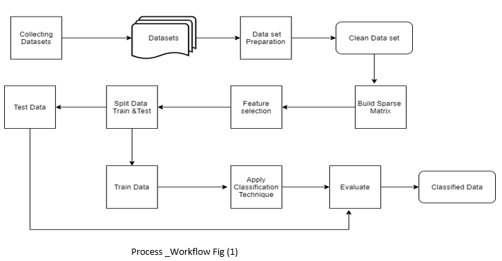
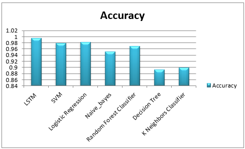

Every day millions and millions of news are being published around the world,
each one of them is telling an information, giving hope, expressing people
opinion or  telling a story of someone ‘s victory  each one of them is
considered  valuable to a user  with particular interest. Day after day this
data are being available online in text form and classifying them became more
difficult but with ML (Machine Learning) and the available new tools they
provide very useful classifications to these texts. But the steps of the process
require some preparing steps which is essential for the process and for
enhancing the results   in this document I will explain the steps of my news
classifier, including preprocessing steps, the classification models I applied
to the data-set   and accuracy of each one of them, no one will be accurate
100%; but as it is known in ML “All models are wrong but some are useful”.

 
